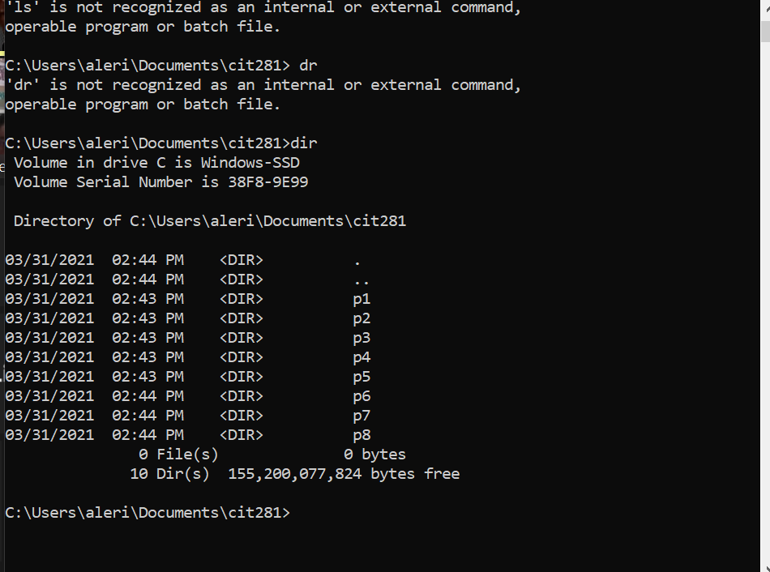

## Techniques Used 

- CLI commands
- VSCode hotkeys
- Non-web server Node.js JavaScript code
    - Functions
    - for loops
    - console.log() method

## Objectives

### Practice completing tasks using the command line interface. 



### Document hotkeys

[lab-01.shorcuts](https://lizz02.github.io/cit281-lab01/lab-01.shortcuts.txt)

### Write a block of code to log the square root of numbers to the console

```
function square(num) {
    return num*num;
}
console.log('Square operations:')
for (let i = 2; i <= 10; i+=2) {
    console.log(`Square of ${i} is ${square(i)}`);
}

```

